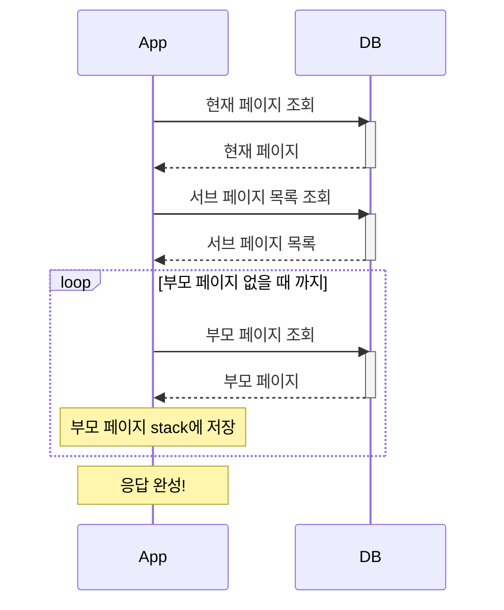
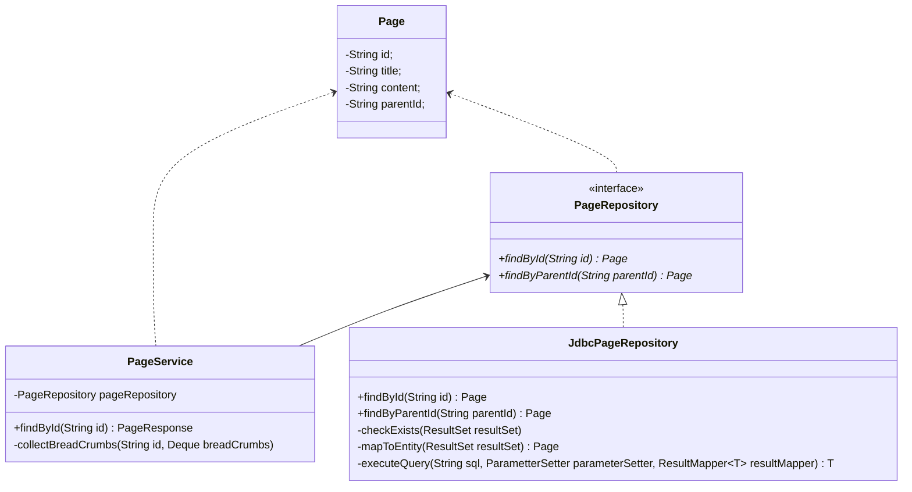
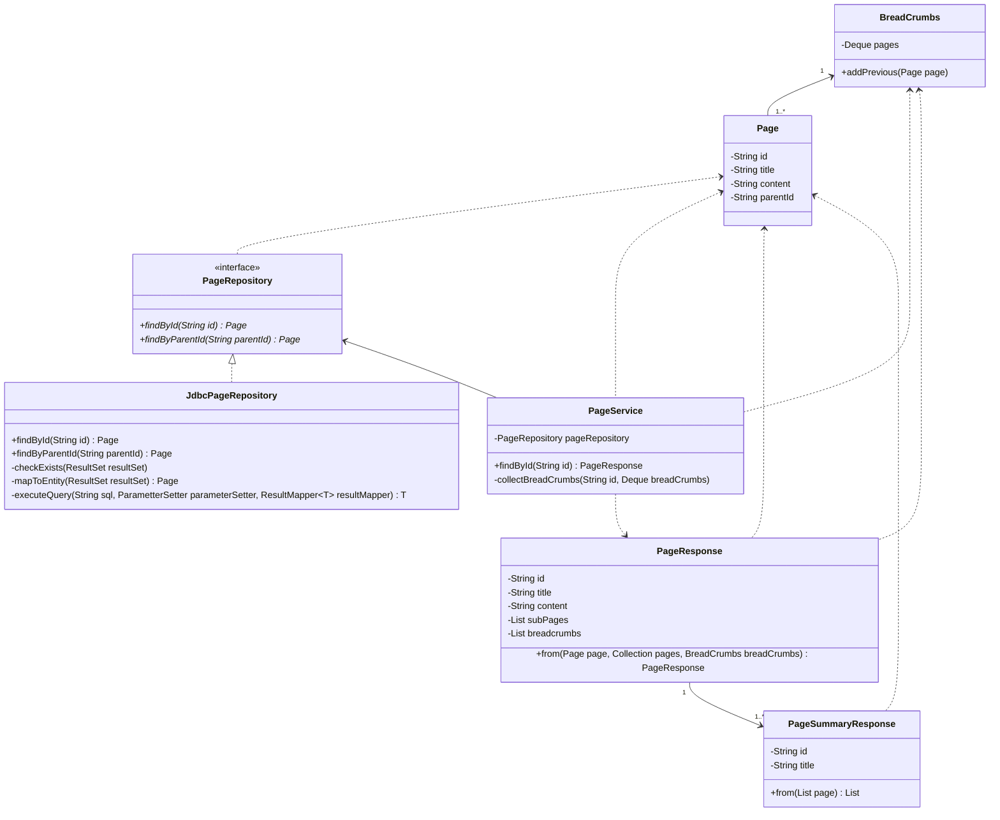

# 밍기적 - 브로드 크럼스(Breadcrumbs) 만들기

### Mission & Requirement
```
노션과 유사한 간단한 페이지 관리 API를 구현해주세요. 각 페이지는 제목, 컨텐츠, 그리고 서브 페이지를 가질 수 있습니다. 또한, 특정 페이지에 대한 브로드 크럼스(Breadcrumbs) 정보도 반환해야 합니다.

페이지 정보 조회 API**: 특정 페이지의 정보를 조회할 수 있는 API를 구현하세요.
- 입력: 페이지 ID
- 출력: 페이지 제목, 컨텐츠, 서브 페이지 리스트, **브로드 크럼스 ( 페이지 1 > 페이지 3 > 페이지 5)**
- 컨텐츠 내에서 서브페이지 위치 고려 X
```

### Team Work Flow

> 회의 -> 개인 작업 -> 공유 -> 피드백 -> 수정 -> 최종 결과물

- 1차 task: DB 스키마 설계 + 피드백
- 2차 task: 재귀 로직 의사코드 작성 + 피드백
- 3차 task: 코드 작성 및 PR + 코드 리뷰
- 4차 task: 최종 결과물 리팩토링
- 5차 task: 문서화

# Specification

### DB Schema

``` sql
CREATE TABLE IF NOT EXISTS "PAGE" (
  "id" VARCHAR(36) NOT NULL,
  "title" VARCHAR(255) NOT NULL,
  "content" VARCHAR(4000), 
  "parentId" VARCHAR(36),
  PRIMARY KEY ("id"),
  FOREIGN KEY ("parentId") REFERENCES "PAGE"("id")
);
```

### API Response
```json
{
    "id": "n9u12uh9fdh379uhf",
    "title" : "페이지 제목",
    "content": "페이지 내용입니다.",
    "subPages" : [
        {
            "id": "3n71436y78934nc2z3",
            "title": "서브 페이지 제목"
        }
    ],
    "breadcrumbs" : [
        {
            "id": "xm823478397x4912x12",
            "title": "상위 페이지 제목"
        }
    ]
}
```

# Project

### Package Structure
```plain text
└─org.example(root)
        ├─data
        │      DataSource.java
        │      JdbcPageRepository.java
        │      
        ├─domain
        │      BreadCrumbs.java
        │      Page.java
        │      PageRepository.java
        │      
        ├─dto
        │      PageResponse.java
        │      PageSummaryResponse.java
        │      
        └─service
                PageService.java
```


### Dependencies

#### DB
- [MySQL Connector Java](https://mvnrepository.com/artifact/mysql/mysql-connector-java) » [8.0.33](https://mvnrepository.com/artifact/mysql/mysql-connector-java/8.0.33)
- [H2 Database Engine](https://mvnrepository.com/artifact/com.h2database/h2) » [2.2.220](https://mvnrepository.com/artifact/com.h2database/h2/2.2.220)

#### Test
- [AssertJ Core](https://mvnrepository.com/artifact/org.assertj/assertj-core) » [3.24.2](https://mvnrepository.com/artifact/org.assertj/assertj-core/3.24.2)
- [JUnit Jupiter API](https://mvnrepository.com/artifact/org.junit.jupiter/junit-jupiter-api) » [5.10.0](https://mvnrepository.com/artifact/org.junit.jupiter/junit-jupiter-api/5.10.0)
- [JUnit Jupiter Engine](https://mvnrepository.com/artifact/org.junit.jupiter/junit-jupiter-engine) » [5.10.0](https://mvnrepository.com/artifact/org.junit.jupiter/junit-jupiter-engine/5.10.0)

### 전체 처리 흐름



### Classe Diagram

#### 주요 class


#### full class diagram


# Note

#### DB 조회 Template method

`Repository` 내에 DB 접근 관련 로직을 캡슐화하여 service가 data 저장 방식에 관여하지 않도록 구현했습니다.

SQL문 실행 시 `SQLException` 예외 처리와 자원 반납이 반복되게 되는데, 이를 template method(`executeQuery`)로 분리하였습니다. 각각의 조회 method에서는 주 관심사인 sql문 작성, parameter 세팅, 결과 mapping에만 집중하게 됩니다.

#### Test용 Data Setup

오직 테스트만을 위한 ddl문과 insert문의 실행이 필요합니다. test class내부에 이를 모두 작성하면 given에 대한 파악이 어렵습니다. 따라서 `DataSetup`이라는 util class를 만들어 분리하고 sql을 일일이 읽고 파악하는 대신 method 이름을 통해 data가 어떻게 설정되었는지 드러내도록 했습니다.

insert문의 경우 각각의 test case에 맞게 data row를 세팅할 수 있도록 parameter로 `rows`를 전달받습니다. 각 test case마다 어떤 data들이 세팅되어 있는지 한 눈에 파악할 수 있습니다.

<br/>

# Team Review

### 권예진
> 개인 코드 및 PR: https://github.com/JinuCheon/ming-miracle/pull/2

### 고민했던 부분들

bread crumbs를 조회하는 방식은 크게 두 가지를 놓고 고민했다.

1. 각각의 페이지를 따로 조회(application에서 재귀 탐색 하며 쿼리 호출)
2. 한 번에 모든 bread crumbs를 조회(재귀 쿼리)

#### 성능 관점

DB와 Application이 각각 별도의 서버로 구성된 상황을 가정하고 생각했다. 1번은 2번에 비해 서버 간 통신로 인한 네트워크 비용이 많이 발생한다. 2번은 DB 서버 호출 자체는 한 번이지만, 그 한 번의 호출로 긴 시간이 필요한 조회 쿼리를 실행하게 된다.

조회 쿼리 처리가 길어질 경우, application 입장에서는 connection이 하나의 thread에 의해 너무 오랫동안 점유되는 문제가 있다. DB의 입장에서는 long transaction이 문제가 될 수 있다. MySQL innoDB의 경우 select에 별도의 lock이 걸리지는 않지만, 해당 쿼리가 실행되는 사이에 undo log가 쌓이는 것이 문제가 될 수 있다(격리 레벨이 Repeatable Read 이상인 경우). innoDB를 사용하는 [MariaDB의 공식 문서](https://mariadb.com/kb/en/innodb-undo-log/#effects-of-long-running-transactions)에서도 언급된 문제다.

처리 속도는 서버 환경에 따라 다를 수 있어 테스트 없이 정확하게 알 수는 없다. 그러나 long transaction은 단순히 처리 속도가 지연되는 것 이외에 side effect가 많을 것이라고 생각된다.

#### 유지 보수 관점

bread crumbs 조회는 단순한 데이터 조회라고 보기에는 그 배경에 다양한 도메인 규칙이 존재한다. page간의 관계에 대한 규칙, bread crumbs의 정렬 순서에 대한 규칙, bread crumbs에 포함될 데이터에 대한 규칙 등 조회 하나에도 이렇게 많은 규칙이 숨어있다. 이러한 도메인 규칙은 코드로 유연하게 표현하고 관리하는 것이 좋다. 코드 레벨이 아닌 쿼리로만 관리된다면 유지 보수에 취약해진다.

#### RDBMS vs NoSQL?

팀 회의에서 재미있는 아이디어가 나왔다. NoSQL document DB의 유연한 schema를 활용해서 각 페이지마다 bread crumbs를 json array field로 가지고 있게 하는 설계였다.

이번 과제가 조회 구현에 한정되어있기 때문에 조회만 단편적으로 생각한다면 아마 압도적인 조회 성능을 보이는 방법이 아니었을까 싶다. 그러나 이 방식을 채택하지 않은 이유는 쓰기 작업의 비용 때문이다. 과제엔 포함되어있지 않지만 notion이라는 서비스에서 쓰기 기능은 필수적이다. 만약 위와 같은 방식으로 저장한다면 페이지 간의 관계가 수정될 때 마다 연관된 모든 page들의 계층 구조를 수정해야 한다. 시간복잡도는 `자식페이지의 수 * 자식의 자식페이지 수 * 자식의 자식의 자식페이지 수` ...*그만 알아보도록 하자*. 실제로 제안하신 진우님도 `조회만 생각한다면…` 이라고 재차 강조하셨다 😂

서비스의 특성이 달랐다면 충분히 고려할 수 있는 방법이라고 생각한다. 당연히 RDBMS를 쓴다고 생각하기 쉬운데 NoSQL까지 고민해오신 팀원분의 유연한 발상에 정말 감탄했다! 덕분에 생각치 못한 부분에 대해 고민해 볼 수 있었다.

<br/>

### 양슬기
> 개인 코드 및 PR: https://github.com/JinuCheon/ming-miracle/pull/3

안녕하세요, 밍기적 팀원 여러분들! 먼저 그동안 팀과제를 위해 함께 달려오느라 고생 많으셨습니다.
제가 팀원분들의 생각과 노력을 바탕으로 개선된 현시점의 코드에서 더 나은 성능에 대한 고민을 해보았는데요.

Java 비즈니스 로직 측면에서는 좋은 방안이 잘 떠오르지 않아서 DB적인 관점에서 고민을 해봤습니다.

현재 시점에서 데이터베이스 테이블에 인덱스가 걸려 있지 않은 상태라면, Page 테이블에 인덱스를 추가하여 데이터를 조회할 때 성능을 향상시킬 수 있지 않을까? 생각해봤습니다.

이미 id 컬럼은 PK로 설정이 되어 있기 때문에 생략하고, 주로 데이터를 조회할 때 WHERE 절에서 사용되는 parentId를 인덱스로 설정하면 좋을 것 같다는 생각을 해보았습니다.

현재 DB_CLOSE_DELAY=-1 옵션을 사용 중이므로, H2 콘솔에 직접 DDL 쿼리를 날리거나
DataSetup 클래스에 Index 추가하는 로직을 추가하는 방안을 고민해봤습니다.
더 좋은 방안이 있다면 피드백 부탁드립니다~!

```
-- 1) H2 콘솔에서 직접 "parentId" 컬럼에 인덱스 생성
CREATE INDEX idx_parentId ON "PAGE" ("parentId");
```


```
-- 2) DataSetup 클래스 createTable 메서드에서 테이블 DDL에 Index 설정 추가하기
public static void createTable() {
    execute("CREATE TABLE IF NOT EXISTS PAGE ("
            + "  id VARCHAR(36) NOT NULL,"
            + "  title VARCHAR(255) NOT NULL,"
            + "  content VARCHAR(4000), "
            + "  parentId VARCHAR(36),"
            + "  PRIMARY KEY (id),"
            + "  FOREIGN KEY (parentId) REFERENCES PAGE(id),"
            + "  INDEX idx_parentId (parentId)" // parentId로 인덱스 생성 추가
            + ");");
}
```

<br/>

### 한준수
> 개인 코드 및 PR: https://github.com/JinuCheon/ming-miracle/pull/3

분명 회의를 하고 의사코드를 작성하는 단계까지는 다들 더 비슷한 구조였던 것 같은데, 막상 구현을 하고 보니 생각보다 더 다양한 방식으로 구현해서 각자의 차이가 느껴졌습니다.

저의 경우 Connection pool을 사용 할 때 Spring의 기본 CP인 Hikari CP를 사용했던 부분이 있었는데, 평소 그냥 JPA를 사용해 구현하던 메서드들의 내부 동작을 직접 최적화하여 구현해 본다면 어떨까? 하는 생각으로 선택한 측면도 있는 것 같습니다.

다만 관련 설정의 maximum-pool-size라던가 minimum-idle 같은 옵션의 값은 (과제의 예상 서비스의 크기가 미정이긴 했지만) 예상 서비스의 사이즈에 맞게 최적화하지 않고 사용한 점이 존재하므로, 이에 대해 좀 더 생각해 보면 좋을 것 같습니다.

ps. 과제에서는 조회 API만 가정하였기 때문에 모처럼 UUID로 ID를 설정하였는데 생성에 대해서는 고민할 필요가 없었지만, 생성할 필요가 있었다면 JUG를 사용하여 인덱싱이 가능하도록 순차적인 값을 가지고 생성했을 것 같습니다.

<br/>

### 조국선
> 개인 코드 및 PR: https://github.com/JinuCheon/ming-miracle/pull/4

**제가 보는 관점 에서 성능이 최적화 되어 있다고 느끼는 점.**

DB에 접근 하는 방법이 최적화 되어 있다고 생각 합니다.
먼저 쿼리를 최적화 하여 데이터 조회 시 필요한 요청 만을 보내도록 되어있고, (쿼리문 최적화)
연결되는 자원 관리는 try-with-resources 구문을 사용하여 DB연결을 효과적으로 처리하고 있습니다.
(**Connection**, **PreparedStatement**, **ResultSet**의 자원을 닫아 누수를 방지하고 있습니다.)

또한, 메인 서비스로직에서 **breadcrumbs**의 정보를 수집 할 때 가져온 호출 정보를 활용하여 중복 호출을 피해 효율적인 
쿼리 요청으로 데이터를 조회하고 있습니다. (재귀 함수를 활용)

그리고, **List.copyOf(subPages)** 를 사용하여 불필요한 객체 생성을 방지하고 불변성을 유지 한 채 복제하여 성능 상의 이점을 가져가는 것 같습니다.

**추가적인 성능 개선 방향의 고민**

먼저 첫번째로  고민 해볼 수 있는 방법은 조회 된 데이터를 캐싱 처리를 하여 성능을 더 최적화 할 수 있을 것 같습니다.
조회 된 결과를 캐싱 하여 동일 쿼리 조회 시 캐시 에서 응답하여 데이터베이스 부하를 줄여 성능을 더 최적화 할 수 있을 것 같습니다.

또 다른 생각 나는 방법은 NoSQL DB도 고려 해볼 만한 것 같습니다.
NoSQL은 유연성과 확장성이 좋아 추가적인 성능상의 이점을 제공 할 수 있을 것 같습니다.
다만 트랜잭션 관리가 어려워 이 부분은 고려하여 생각 해보아야 할 것 같습니다.

이상입니다!

<br/>

### 천진우
> 개인 코드 및 PR: https://github.com/JinuCheon/ming-miracle/pull/5

#### 다양한 재귀접근의 방식들
처음 얘기를 주고받으며, 재귀를 application 레벨이 아닌 DB 레벨에서 `스토어드 프로시저`로 처리하는 게 어떨까? 라는 의견들을 주고받았습니다. 그러나 스토어드 프로시저의 경우 조회 속도가 빠를 수 있지만 커넥션 주기가 재귀 호출 회수만큼 길어지고 커넥션 고갈 또는 데드락 문제가 흔하게 일어나는 이슈가 있습니다(select 쿼리에서 해당 문제가 자주 발생하는지는 모르겠습니다만)

일단 재귀 로직에 대한 공부를 목적으로 application에서 구현하는 방향으로 진행해 보았습니다.

#### 현재의 구조에서 고민해 볼 수 있는 최적화 방식들
1. 적절한 index 설정: breadcrumbs는 pk로 조회가 되겠지만, child 문서들을 찾는데에는 효율적인 검색을 위해 `parent_id` index 지정을 해줍니다.
2. 자체 index 생성해서 클라이언트에 캐싱: index라기보다 Tree 형태의 map 으로 볼 수 있을까요? 문서 구조의 전체 Tree를 클라이언트에서 캐싱하고 있는 방법입니다. 

#### 번외1. 재귀를 쓰지 않고 JSON 타입을 활용해 보는건 어떨까요?
최신 RDB 들은 JSON 타입을 지원합니다. 문서 생성 시점에 이것을 활용하면 breadcrumbs 을 별도로 조회할 수 있게 될 것 같습니다. 그렇지만 문서의 상속 구조가 바뀌게 되면 연산량이 엄청날 수 있다는 문제가 있었습니다. 그렇지만 클라이언트에서 상속 구조에 대한 연산을 해서 서버로 넘기게 되면 최소화할 수 있을 거라는 생각을 하게 되었습니다.

#### 번외2. 그렇다면 문서형 DB를 써보는 게 어떨까요?
몽고DB 는 sub 데이터를 직접 기록하는 embedded 구조 외에도 내부적으로 참조형 자료를 제공합니다. 만약 추후에 breadcrumb에서 추가적인 컬럼이 필요하다고 하더라도 RDB의 JSON이 가지고 있는 구조의 한계를 벗어나서 확장성 있는 설계가 가능합니다.

<br/>

### 정대철
> 개인 코드 및 PR: https://github.com/JinuCheon/ming-miracle/pull/6

**팀 과제를 마치며…**
성능에 대한 고민이라면 저장과 조회 기능을 주로 생각하게 됩니다. 이전에는 데이터를 저장할 때 배열이나 ArrayList를 주로 사용하며 시간 복잡도에 대해 깊은 고민을 하지 않았던 것 같습니다. 최근 Stack과 Linked List 등 여러 자료구조를 학습하며 이번 과제에 적용해 보았고 무엇이 다른지, 복잡도는 어떤지, 코드의 흐름에 대해 더 구체적인 고민을 했던 것 같습니다.
<br>

**프로젝트 규모가 커짐에 따라 생각할 문제들**
1. Index 설정
Page 테이블의 id는 pk로 문제가 없겠지만 parentId는 인덱스 설정이 필요할 것 같습니다.

2. 멀티 스레드?
개인적인 코드에서는 db에서 뽑아온 전체 데이터를 HashMap <id : Page>으로 저장해 캐시 형태로 뽑아 쓰도록 구현했습니다. 한 가지 궁금한 것은 hashMap에 데이터를 저장하는 과정에서 batch size, 스레드 풀을 설정하여 멀티 스레드 환경을 구성할 수 있는지, 된다면 개선이 얼마나 될지에 대한 궁금함이 있습니다.
